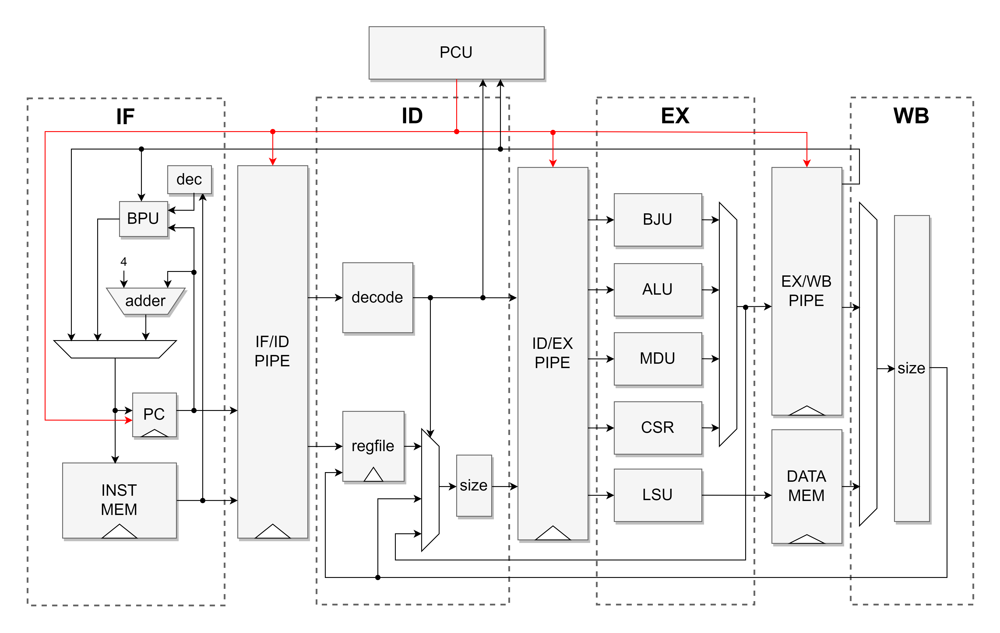

# k423 Core and SoC

## Introduction

k423 is a RISC-V core and SoC.

- The core's architecture are as follows:

  - RV32I ISA supported
  - 4-stage pipeline

See the core's [document](doc/k423_core.md) in `./doc` .



- The SoC
  - Hasn't been implemented yet


## Directory

- doc
- rtl
  - config: configure macros in `k423_config.svh` 
  - core: rtl of the core
  - utils: common utils used in design
  - tb: testbench of isa and others
- tests
  - riscv-tests

## Getting Started

### Dependencies

- RTL Simulator
  - [iverilog](https://github.com/steveicarus/iverilog) 
  - Synopsys VCS (VCS-MX O-2018.09-SP2 has been tested)
- Wave Viewer
  - [gtkwave](https://github.com/gtkwave/gtkwave) 
  - Synopsys Verdi (Verdi O-2018.09-SP2 has been tested)
- [RISC-V GNU Toolchain](https://github.com/riscv-collab/riscv-gnu-toolchain) 
  - Add it to your `$PATH` .
  - Default prefix is `riscv32-unknown-elf-` . You can modify it in `test/riscv-tests/isa/Makefile` .

### Usage

#### RISC-V Tests

Get memfiles for ISA tests in `./test/riscv-tests/isa/` :

```shell
make
```

#### Simulation

Run simulation:

```shell
make sim SIM_TOOL=[default: iverilog] TB=[default: isa]
# SIM_TOOL: iverilog/vcs
# TB: see ./rtl/tb/tb_*.sv
```

Get waveform:

```shell
make wave WAVE_TOOL=[default: gtkwave]
# WAVE_TOOL: gtkwave/verdi
```

## Release History
