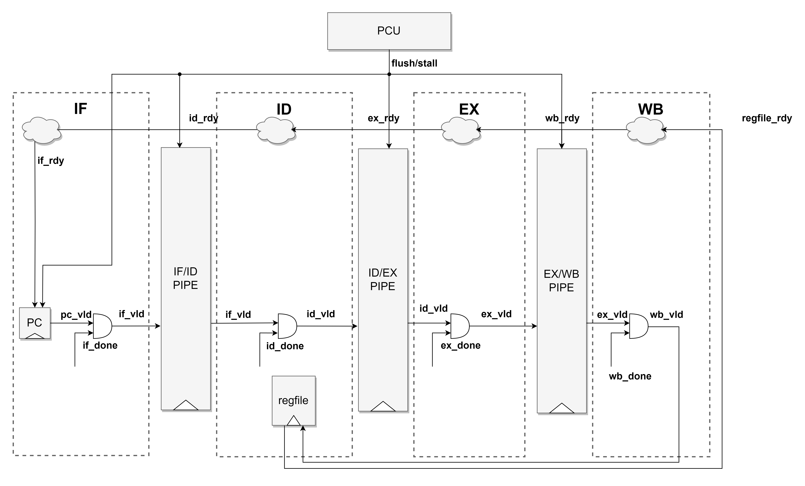

# k423 Core

## Architecture

k423 is a RISC-V core. It's features are as follows:

- RV32I ISA supported
- 5-stage pipeline

Below is the architecture diagram of k423 core.


### IF Stage

- Generate `pc` from `pc + 4` or `branch_pc`. Hasn't implement branch-prediction now.

- Fetch instruction using `next_pc` for synchronized instruction memory .

  > Reset `pc_stage_vld` to ignore the first invalid pc & inst.

### ID Stage

- Decode instruction type, rs/rd/imm and other informations.
- Read rs1/2 data from regfile combinationally. Select the valid data from ex_forward/mem_forward/wb_forward/regfile (has priority), and resize them when it's `STORE` instruction.
- Write back rd data sequentially.

### EX Stage

- ALU calculates for `ADD/SUB`, `AND/OR/XOR`, `SLL/SRL/SRA`, `SLT`, `LUI`, `AUIPC`. It takes 2 adder32, 1 barrel-shifter32, 3 logic-operator32 and other resources.

- LSU calculates `LOAD/STORE` address, and send mem-req to synchronized data memory. It takes 1 adder32 and other resources.

- BJU calculates the branch-taken for `BXX` instructions, and branch-address for `BXX/JXX` instructions. It takes 2 adder32 and other resources. 

  > One of the adder32 can use ALU datapath, but the circuit may be more complicated.

- MDU hasn't been implemented yet.

### MEM Stage

- Select write back data from data memory and ALU/MDU/BJU, and resize it when it's `LOAD` instruction.

  > Reading from data memory takes times. The select and resize logic can be moved to WB stage to decrease delay. But in that case, mem_forward will be invalid when instruction in ID stage needs the `LOAD` data in MEM stagenow. Pipeline blocking must be taken, which reduces efficiency.

- Send branch informations to IF Stage.

  > EX Stage can also send them, but it will make critical path longer and reduce the frequency. On the contrary, sending them in MEM Stage reduce the pipeline efficiency.

### WB Stage

- Write back data to regfile.

### Pipeline



### PCU (Pipeline Control Unit)

- When receiving `branch_taken` signal from MEM Stage, flush pipe of IF/ID, ID/EX and EX/MEM.
- When load-use harzard occurs, stall pipe of PC, IF/ID, ID/EX.

## Interface

- Instruction Memory Interface

| Name                 | Direction | Width        | Description               |
| -------------------- | --------- | ------------ | ------------------------- |
| mem_inst_req_vld_o   | output    | 1            | request is valid          |
| mem_inst_req_addr_o  | output    | CORE_ADDR_W  | request address           |
| mem_inst_req_rdy_i   | input     | 1            | memory is ready           |
| mem_inst_rsp_vld_i   | input     | 1            | memory respone valid      |
| mem_inst_rsp_rdata_i | input     | CORE_FETCH_W | memory response read data |

- Data Memory Interface

| Name                 | Direction | Width        | Description                             |
| -------------------- | --------- | ------------ | --------------------------------------- |
| mem_inst_req_vld_o   | output    | 1            | request is valid                        |
| mem_data_req_wen_o   | output    | CORE_XLEN/8  | request write size, read when `4'b0000` |
| mem_inst_req_addr_o  | output    | CORE_ADDR_W  | request address                         |
| mem_data_req_wdata_o | output    | CORE_XLEN    | request write data                      |
| mem_inst_req_rdy_i   | input     | 1            | memory is ready                         |
| mem_inst_rsp_vld_i   | input     | 1            | memory respone valid                    |
| mem_inst_rsp_rdata_i | input     | CORE_FETCH_W | memory response read data               |

- Debug Interface

| Name              | Direction | Width         | Description       |
| ----------------- | --------- | ------------- | ----------------- |
| debug_wb_pc_o     | output    | CORE_ADDR_W   | WB stage pc       |
| debug_wb_rd_vld_o | output    | 1             | WB stage rd valid |
| debug_wb_rd_idx_o | output    | INST_RSDIDX_W | WB stage rd index |
| debug_wb_rd_o     | output    | CORE_XLEN     | WB stage rd data  |

## RTL Files

| RTL Name         | Description                                                  |
| ---------------- | ------------------------------------------------------------ |
| k423_core        | Top module of the core                                       |
| k423_pcu         | Pipeline control unit                                        |
| k423_if_stage    | IF stage                                                     |
| k423_if_pcgen    | Generate pc                                                  |
| k423_if_bpu      | Branch prediction unit                                       |
| k423_if_fetch    | Fetch interface to instruction memory                        |
| k423_id_stage    | ID stage                                                     |
| k423_id_decode   | Decode instruction informations                              |
| k423_id_regfile  | Regfile, forward and resize                                  |
| k423_ex_stage    | EX stage                                                     |
| k423_ex_alu      | ALU                                                          |
| k423_ex_mdu      | MDU                                                          |
| k423_ex_lsu      | Generate address of LOAD/STORE, and request interface to data memory |
| k423_ex_bju      | Branch/Jump judgement unit                                   |
| k423_mem_stage   | MEM stage                                                    |
| k423_wb_stage    | WB stage                                                     |
| k423_pipe_if_id  | Pipe between IF/ID stage                                     |
| k423_pipe_id_ex  | Pipe between ID/EX stage                                     |
| k423_pipe_ex_mem | Pipe between EX/MEM stage                                    |
| k423_pipe_mem_wb | Pipe between MEM/WB stage                                    |

## Configuration

| Config Macro | Description       | Default       |
| ------------ | ----------------- | ------------- |
| RST_PC       | reset value of pc | 32'hFFFF_FFFC |
|              |                   |               |

## PPA

Evaluate PPA of k423 core using [yosys-sta](https://github.com/OSCPU/yosys-sta) and nangate45 PDK. The reports are as follows.

- Timing
  - The report shows that the critical path is located in the BJU and ALU adder-datapath (discarding the mem-req delay).

```
+-----------------------------+-------------+------------+------------+---------------+-------+-------+-----------+
| Endpoint                    | Clock Group | Delay Type | Path Delay | Path Required | CPPR  | Slack | Freq(MHz) |
+-----------------------------+-------------+------------+------------+---------------+-------+-------+-----------+
| u_k423_pipe_ex_mem/_1680_:D | core_clock  | max        | 1.671f     | 1.961         | 0.000 | 0.289 | 584.481   |
| u_k423_pipe_id_ex/_2067_:D  | core_clock  | max        | 1.644f     | 1.961         | 0.000 | 0.316 | 593.978   |
| u_k423_pipe_ex_mem/_1680_:D | core_clock  | max        | 1.627r     | 1.967         | 0.000 | 0.341 | 602.719   |
| u_k423_id_regfile/_15697_:D | core_clock  | min        | 0.160f     | 0.003         | 0.000 | 0.158 | NA        |
| u_k423_id_regfile/_15699_:D | core_clock  | min        | 0.160f     | 0.003         | 0.000 | 0.158 | NA        |
| u_k423_id_regfile/_15702_:D | core_clock  | min        | 0.160f     | 0.003         | 0.000 | 0.158 | NA        |
+-----------------------------+-------------+------------+------------+---------------+-------+-------+-----------+
```

- Area

```
   Number of wires:              17965
   Number of wire bits:          21738
   Number of public wires:        2669
   Number of public wire bits:    6442
   Number of memories:               0
   Number of memory bits:            0
   Number of processes:              0
   Number of cells:              16287
   
   Chip area for top module '\k423_core': 24820.194000
```

- Compared with [tinyriscv](https://github.com/liangkangnan/tinyriscv) core

  > The function of this two cores has a huge difference, so this is just a reference.

```
+------------------------+-------------+------------+------------+---------------+-------+--------+-----------+
| Endpoint               | Clock Group | Delay Type | Path Delay | Path Required | CPPR  | Slack  | Freq(MHz) |
+------------------------+-------------+------------+------------+---------------+-------+--------+-----------+
| u_id_ex/op2_ff/_316_:D | core_clock  | max        | 3.343f     | 1.961         | 0.000 | -1.382 | 295.644   |
| u_id_ex/op2_ff/_316_:D | core_clock  | max        | 3.346r     | 1.969         | 0.000 | -1.378 | 296.068   |
| u_id_ex/op2_ff/_303_:D | core_clock  | max        | 3.338f     | 1.961         | 0.000 | -1.377 | 296.092   |
| u_clint/_2820_:D       | core_clock  | min        | 0.119f     | 0.002         | 0.000 | 0.118  | NA        |
| u_clint/_2822_:D       | core_clock  | min        | 0.119f     | 0.002         | 0.000 | 0.118  | NA        |
| u_clint/_2826_:D       | core_clock  | min        | 0.119f     | 0.002         | 0.000 | 0.118  | NA        |
+------------------------+-------------+------------+------------+---------------+-------+--------+-----------+
```

```
   Number of wires:              34575
   Number of wire bits:          39023
   Number of public wires:        3220
   Number of public wire bits:    7668
   Number of memories:               0
   Number of memory bits:            0
   Number of processes:              0
   Number of cells:              32325
   
   Chip area for top module '\tinyriscv': 47790.890000
```

